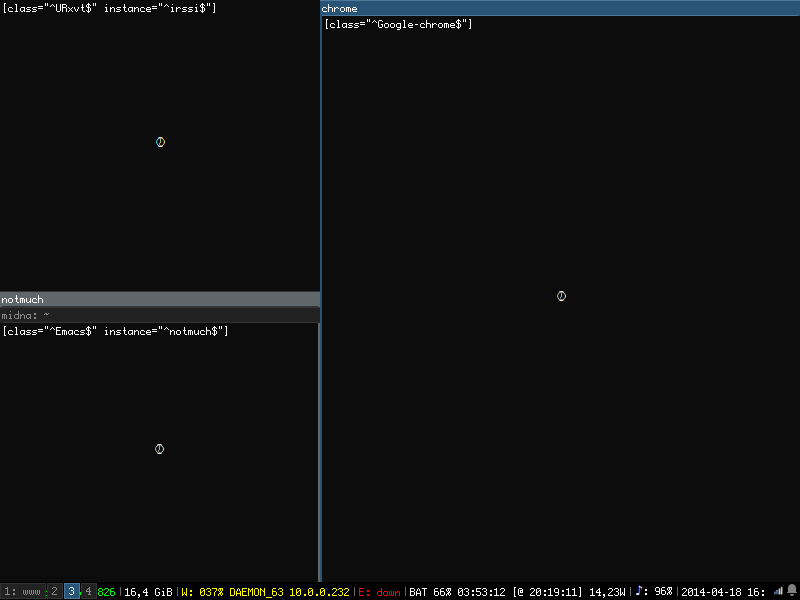

Ergonomics is a very simple and beautiful principle that I would summarize as: adapt your tools to yourself, not yourself to your tools.

The one problem with ergonomics? It’s addictive. Once you have experienced a more seamless way of doing something (especially when you repeat that something hundreds or thousands of times a day), there’s no turning back — and that’s exactly why I will never use anything other than a tiling window manager again.

===

As a developer, your typical daily workflow will include many program windows, typically: one or many IDE windows, one or many terminal windows, one or many browser windows (or more likely one window with a hundred tabs), maybe a database client, probably at least one messenger app... and that's just your typical day.

Now an open question: how do you organize your windows so that your can easily switch between contexts, which is likely to happen hundreds of times a day? To make it more fun, let's take the worst case scenario: today, you don't have access to additional monitors, you have just the one screen.

This simple question is at the core of what i3 beautifully solved for me. If you find yourself alt-tabbing between apps like crazy all day long: first, there's no shame in that — I did it for many years. Also, stay tuned; you might love i3 for exactly the same reasons I do.

## A brief personal history

### From Windows to MacOS

I started my IT journey many moons ago, and I did it just like most people: by installing a C IDE on my personal computer. Which means I started my development journey on — that's right: Windows! And I'm glad I did; one needs to experience pain and sorrow to later truly appreciate bliss and joy, right?

After a few years of struggling with Cygwin — aaaah, the memories —, only interrupted by the occasional blue screen, I was offered a MacBook Pro by the first company that hired me as a remote contractor. My natural animosity towards Apple as a company made me skeptical, sure, but if you're gonna generously send me a device that many people agree is of great quality, I might as well try it to see how I like it.

It didn't take me long to admit what was very obvious: the MacOS experience, especially as a developer, was a whole universe above the Windows experience. In short, I started to enjoy:
- A native UNIX style terminal
- A package manager (homebrew)
- A search bar that you can pop up anytime, fuzzy search capable, and actually returns relevant results.
- An app launcher
- Virtual workspaces, with full screen apps being sent to a new workspace by default

My workflow was quickly transformed and improved in more than one way. But let's focus on the core topic of this article: window management. And in that regard, quickly switching between full screen apps with the trackpad gesture or a keyboard shortcut was *way* more practical than alt-tabbing through a huge list of running programs, whose ordering isn't even consistent.

Windows? Never again, I told myself (for reasons that are not purely related to ergonomics and whose scope would make me digress way too much, so let's skip ahead...).

### From MacOS to Linux

But then, after several years, my MacBook started to show signs of fatigue. And when came the time to pick its successor, my Apple hatred came back to me: I decided that if I could obtain the same ergonomics from my next machine, without having to settle for a closed and overpriced environment, then I would do it.

There started the research for my new work setup. I naturally opted for a Linux distribution I knew: Ubuntu, which comes with GNOME as its default DE (Desktop Environment). After some tweaking and quite some time searching the docs, I concluded that the MacOS experience regarding workspaces and full screen apps couldn't be fully reproduced, especially in a multi screen setup. And I'm glad it didn't work, or I might have settled for something way less good.

## Finally: i3

### Why it's awesome

Let's start with the basics: i3 is not a DE (Desktop Environment), it's a WM (Window Manager). A WM is the small part of the DE that specifically takes care of how windows are displayed and controlled. Most users won't even notice the WM, since in most cases switching to another DE will be enough to customize your experience as you see fit. 

So, why customize the WM? Because i3 is a *tiling* WM: instead of opening windows that are either full screen or floating (= free to be moved around with your mouse), it will by default open windows as tiles. And tiles will be organized on screen in patterns that you can customize. It doesn't sound like a big difference, but believe me, it makes all the difference in the world. 

In the recent versions of Windows, you can move your windows to automatically take i.e. half the screen vertically, or in a couple more preset ways. Now imagine a system built around layouts like these, but way more practical and extensible. 

By default, when you open one window, it will take all space available:

Then, if you open another one, it will split the space (vertically by default) and show both windows side to side:

That's cool, but here's the kicker: there's another layout available, the stacking layout. Here's the same windows, shown in this stacking layout:

Now, these are not the complete picture. These show only one workspace. You can create as many workspace as you want, swap between them, and windows will always be created in your current workspace. Here's the complete screen, with the workspaces showing at the top left hand corner:

And with just these two combined features, workspaces and stacking layout, you can achieve perfect window management! How? Well, because now you can organize your windows in the most natural, comfortable way for our human brains: as a *hierarchy*. 

Organising your windows hierarchically and going to any window with a couple keystrokes (because of course, i3 is 100% controllable with the keyboard) is so practical that today **I would rather work on the single laptop screen with i3 than with 2 external monitors in a non tiling window manager**.

### How I organize my windows

As you will find, i3, being the great ergonomic tool that it is, is extremely customizable. Therefore, what I'm going to describe is only the way *I* find to be the more practical. It can give you an idea of what a good (in my opinion) workflow with i3 can be, and then of course you can adapt it to your liking!

In my default work setup, I have three screens: the laptop internal monitor, and two external ones. I statically assign my workspaces to each screen:
- workspaces 1 to 4 to the main screen
- workspaces 7 and 8 to the secondary screen (external monitor on the right)
- workspaces 5 and 6 to the laptop monitor (on the left)

I will open each new window in a specific workspace depending on its purpose. Here's my repartition:
- Main screen:
    - 1: Terminal windows (using the amazing [tmux](https://github.com/tmux/tmux) — but that's an article for another day)
    - 2: IDE windows
    - 3: main web browser windows, for what I want to open on the main screen (like merge requests, or anything when browsing online is my main focus)
    - 4: it depends on my activity. I will sometimes put here a mail client or a calendar. 
- Secondary screen: by default this will be web browser windows, for anything that's helpful as a side view (typically: documentation). Anything that is helpful to see simultaneously to my main activity will be sent there with a single key stroke
- Laptop screen: messenger apps (Slack, Discord, Teams...). It's always opened in the corner of my eyes, which makes me extremely reactive.

I can navigate the entire OS just with the keyboard, using the mouse only for GUIs that require it (typically the web browser). Here are my most useful keymaps:
- cmd+h/l: move to left/right screen
- cmd+j/k: move to above/below window in the current stack 
- cmd+ctrl+h/l: move to workspace on the left/right
- cmd+shift+h/l: move window to the workspace on the left/right
- cmd+1-8: move to workspace 1-8
- cmd+shift+1-8: move window to workspace 1-8
- cmd+d: open app launcher

Here's an example flow:
- cmd+1: open workspace 1
- cmd+d: open the app launcher, type 'term', hit enter, a terminal opens
- cmd+2: open workspace 2
- cmd+d: open the app launcher, type 'intell', hit enter, intellij opens
- alt+a: open intellij quick actions bar, type 'recent', then a string to identify a recent project
- Do it again to open another project. This project will be stacked below previous one.
- cmd+k: go to the app above in the stack (the project previously opened)
- cmd+h: go to the screen on the left to reply to a Slack message

Many apps will offer a few keybinds that will make the mouse unnecessary in 90% use cases. When everything is configured, it literally feels like there's almost no frontier between your thoughts and your OS. Trust me, that's such a great feeling. Once you've experienced it, there's no coming back.

### Should you switch right now?

If that sounded appealing to you, you really should give it a try... just beware of the fact there is an initial setup time investment. Indeed, a window manager is just a small brick, following the good ol' *Unix philosophy: do one thing, and do it right*. Which means that as a window manager, i3 displays and manages windows and... that's it. A lot of things that you take for granted in any OS are part of the DE, but *not of the WM*. Indeed, i3wm by itself doesn't give you:
- A notification system
- A graphical login screen
- An automatic lock screen
- Usual system tray applets (network, battery, volume...)
- And other things I might have forgotten

When you first run i3, you might get scared away by how basic and barren it looks:

So of course, it'll take time and effort to make it just right... but what you get in exchange is invaluable: you're basically building your own OS, made of bricks you carefully picked along the road. It's a life long endeavour, the possibilities are limitless, and no other OS will ever feel satisfying again... so be warned!

So, that's the point where you should (legitimately) wonder if you'd rather go out and touch grass. If you're like me and don't see the point in that, I wish you good luck and a ton of fun. In case it might help you, here are:
- My [dotfiles repo](https://github.com/le-quentin/dotfiles), in which you'll find a lot of my config files, among which:
    - My [i3 config](https://github.com/le-quentin/dotfiles/blob/master/dot_config/i3/config)
    - My [polybar config](https://github.com/le-quentin/dotfiles/tree/master/dot_config/polybar), forked from [polybar themes](https://github.com/adi1090x/polybar-themes). Polybar is nice OS bar with many possibilities for customization. It's the one I picked but there are many other choices out there (again: Unix philosophy!)
- My [install repo](https://github.com/le-quentin/install), and its outrageously out-of-date readme. It's a set of Ansible playbooks automating the install of my work machine. You'll find there the packages that I installed alongside i3 to turn it into a fully capable DE.

Knock yourself out!

### But... i3 or another tiling WM?

There are many other choices out there. To each their own. To me i3 seemed very good in terms of how the configuration worked, and how popular it is (for open source projects it's a very important metric, in my opinion). Popular alternatives are bspwm and Sway, the latter basically being i3 remade on Wayland. If you ask me, X11 is there to stay for many years, but if you wanna try Wayland or are using it already, it would be an obvious candidate.
